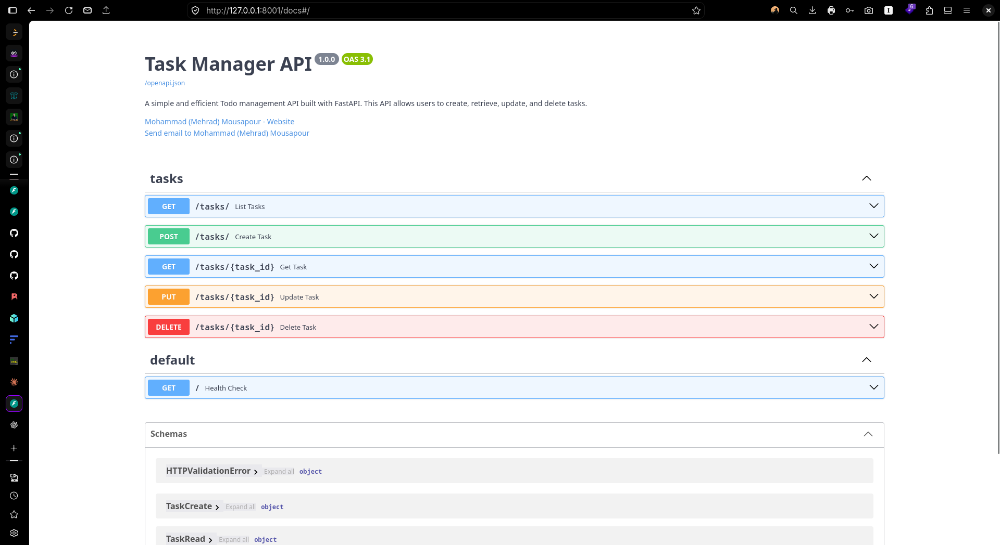
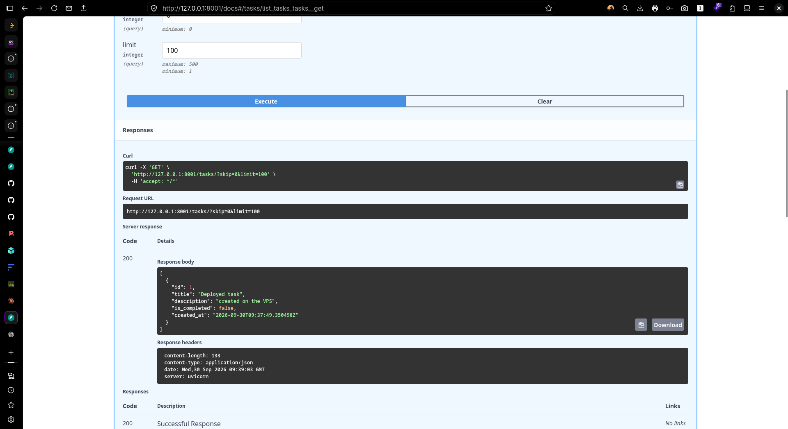
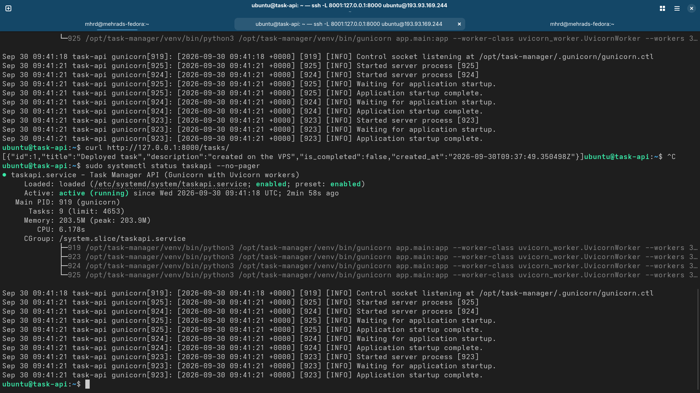

<div align="center">
<h1 align="center">Task Manager API</h1>
<h3 align="center">A simple CRUD API for managing tasks, built with FastAPI and PostgreSQL.</h3>
</div>

<p align="center">
<a href="https://www.python.org" target="_blank">  </a>
<a href="https://fastapi.tiangolo.com/" target="_blank">  </a>
<a href="https://www.postgresql.org" target="_blank">  </a>
<a href="https://www.docker.com/" target="_blank">  </a>
<a href="https://swagger.io/" target="_blank">  </a>
<a href="https://docs.astral.sh/uv/" target="_blank">  </a>
<a href="https://git-scm.com/" target="_blank">  </a>
</p>


## Table of Contents

- [Table of Contents](#table-of-contents)
- [Tech stack](#tech-stack)
- [Project structure](#project-structure)
- [API endpoints](#api-endpoints)
- [Database schema](#database-schema)
- [Local setup](#local-setup)
- [Quick test](#quick-test)
- [Docker Local Setup](#docker-local-setup)
  - [1. Create the environment file](#1-create-the-environment-file)
  - [2. Build and start the containers](#2-build-and-start-the-containers)
  - [3. Check the containers](#3-check-the-containers)
  - [4. Access the API](#4-access-the-api)
  - [5. Stop the application](#5-stop-the-application)
- [Deployment (Ubuntu 24.04, Gunicorn + Uvicorn worker + systemd)](#deployment-ubuntu-2404-gunicorn--uvicorn-worker--systemd)
  - [1. Install system packages](#1-install-system-packages)
  - [2. Configure the firewall](#2-configure-the-firewall)
  - [3. Create the database](#3-create-the-database)
  - [4. Create a service user and the app directory](#4-create-a-service-user-and-the-app-directory)
  - [5. Copy the project to the server](#5-copy-the-project-to-the-server)
  - [6. Create the virtualenv and install dependencies](#6-create-the-virtualenv-and-install-dependencies)
  - [7. Configure the environment](#7-configure-the-environment)
  - [8. Create the tables (once)](#8-create-the-tables-once)
  - [9. Install and start the systemd service](#9-install-and-start-the-systemd-service)
  - [10. Verify](#10-verify)
  - [Screenshots](#screenshots)
  - [Security notes](#security-notes)
  - [Troubleshooting](#troubleshooting)
  - [Notes](#notes)
- [References](#references)

## Tech stack

- Python, FastAPI
- PostgreSQL, SQLAlchemy 2.0 (psycopg2)
- Pydantic (schemas and settings)
- uv (dependency management)

## Project structure

```text
├── app
│   ├── __init__.py
│   ├── config.py        # settings loaded from .env
│   ├── crud.py          # database operations
│   ├── database.py      # engine, session, get_db
│   ├── main.py          # app entry point
│   ├── models.py        # SQLAlchemy models
│   ├── routers
│   │   ├── __init__.py
│   │   └── tasks.py     # /tasks endpoints
│   └── schemas.py       # Pydantic schemas
├── deploy
│   └── taskapi.service
├── LICENSE
├── pyproject.toml
├── README.md
├── requirements.txt
└── uv.lock
```

## API endpoints

| Method | Path | Description |
|--------|------|-------------|
| GET | `/tasks/` | List all tasks |
| GET | `/tasks/{task_id}` | Get one task |
| POST | `/tasks/` | Create a task |
| PUT | `/tasks/{task_id}` | Update a task |
| DELETE | `/tasks/{task_id}` | Delete a task |

Interactive documentation (Swagger UI): `/docs`

## Database schema

Table "public.tasks"

| Column | Type | Notes |
|--------|------|-------|
| `id` | integer | Primary key (indexed automatically) |
| `title` | varchar(255) | Required |
| `description` | text | Optional |
| `is_completed` | boolean | Required, defaults to `false` (set by the application) |
| `created_at` | timestamptz | Set automatically by the database |

## Local setup

1. Start PostgreSQL (example with Docker):

> Replace the placeholder values with your own PostgreSQL credentials and volume name.

```bash
   docker run -d --name <CONTAINER_NAME> \
     -e POSTGRES_USER=<POSTGRES_USER> \
     -e POSTGRES_PASSWORD=<POSTGRES_PASSWORD> \
     -e POSTGRES_DB=<POSTGRES_DB> \
     -p 5432:5432 \
     -v <VOLUME_NAME>:/var/lib/postgresql/data \
     postgres:16
```

2. Install dependencies:

```bash
   uv sync
```

3. Create a `.env` file:

```env
   DATABASE_URL=postgresql+psycopg2://<POSTGRES_USER>:<POSTGRES_PASSWORD>@localhost:5432/<POSTGRES_DB>
```

4. Run the app (tables are created on startup):

```bash
   uv run fastapi dev
```

Open http://127.0.0.1:8000/docs

## Quick test

```bash
curl -X POST http://127.0.0.1:8000/tasks/ \
  -H "Content-Type: application/json" \
  -d '{"title": "First task", "description": "hello :D"}'

curl http://127.0.0.1:8000/tasks/
```

## Docker Local Setup

The project can be run locally using Docker Compose. The Compose setup starts both the FastAPI application and PostgreSQL database.

### 1. Create the environment file

Create a `.env` file in the project root:

```env
POSTGRES_USER=<POSTGRES_USER>
POSTGRES_PASSWORD=<POSTGRES_PASSWORD>
POSTGRES_DB=<POSTGRES_DB>
```

> Replace the values with your own credentials.

### 2. Build and start the containers

Run:

```bash
docker compose up -d --build
```

This will:

- Build the FastAPI image from the `Dockerfile`.
- Start a PostgreSQL 16 container.
- Wait for PostgreSQL to become healthy before starting the API.
- Create a persistent Docker volume for PostgreSQL data.
- Start the FastAPI application on port `8000`.

### 3. Check the containers

```bash
docker compose ps
```

Both `db` and `api` should be running.

To view the API logs:

```bash
docker compose logs -f api
```

To view the PostgreSQL logs:

```bash
docker compose logs -f db
```

### 4. Access the API

The API is available at:

```text
http://127.0.0.1:8000
```

Interactive API documentation:

```text
http://127.0.0.1:8000/docs
```

### 5. Stop the application

To stop the containers:

```bash
docker compose down
```

The PostgreSQL data remains stored in the `pgdata` Docker volume.

To stop the containers and remove the database volume as well:

```bash
docker compose down -v
```

> **Warning:** Removing the volume deletes the PostgreSQL data stored by the Compose setup.

## Deployment (Ubuntu 24.04, Gunicorn + Uvicorn worker + systemd)

This section describes how the API was deployed on an Ubuntu 24.04 VPS. The app runs
as a systemd service: Gunicorn manages Uvicorn workers and listens on `127.0.0.1:8000`
only. PostgreSQL also listens on localhost only, and the firewall allows only SSH.

```text
Internet ──► ufw firewall (only SSH open)
                  │
                  ▼
   VPS: Gunicorn + Uvicorn workers (127.0.0.1:8000) ──► PostgreSQL (127.0.0.1:5432)
```

### 1. Install system packages

```bash
sudo apt update && sudo apt upgrade -y
sudo apt install -y postgresql python3-venv rsync
```

### 2. Configure the firewall

Allow SSH first, otherwise you will lock yourself out:

```bash
sudo ufw allow OpenSSH
sudo ufw enable
sudo ufw status verbose
```

Incoming traffic is denied by default. Ports 5432 (PostgreSQL) and 8000 (the app)
are intentionally **not** opened: the app talks to the database over localhost.

### 3. Create the database

```bash
sudo -u postgres psql
```

> Replace the placeholder values with your own credentials.

```sql
CREATE USER <POSTGRES_USER> WITH PASSWORD '<POSTGRES_PASSWORD>';
CREATE DATABASE <POSTGRES_DB> OWNER <POSTGRES_USER>;
\q
```

Check that PostgreSQL listens on localhost only:

```bash
sudo ss -ltnp | grep 5432
```

Expected: `127.0.0.1:5432`.

### 4. Create a service user and the app directory

The service runs as an unprivileged user without a login shell.

```bash
sudo useradd --system --home-dir /opt/task-manager --shell /usr/sbin/nologin taskapi
sudo mkdir -p /opt/task-manager
sudo chown taskapi:taskapi /opt/task-manager
```

### 5. Copy the project to the server

From your machine (in the project directory):

```bash
rsync -av --exclude '__pycache__' app requirements.txt deploy \
  <USER>@<SERVER_IP>:/tmp/task-manager/
```

On the server:

```bash
sudo cp -r /tmp/task-manager/. /opt/task-manager/
sudo chown -R taskapi:taskapi /opt/task-manager
```

### 6. Create the virtualenv and install dependencies

```bash
sudo -u taskapi python3 -m venv /opt/task-manager/venv
sudo -u taskapi /opt/task-manager/venv/bin/pip install --no-cache-dir \
  -r /opt/task-manager/requirements.txt
```

**Offline alternative** (when the server cannot reach PyPI). On your machine, use the
same Python version as the server (check with `python3 --version` on the server):

```bash
mkdir wheels
uvx --python 3.12 pip download -r requirements.txt -d wheels --only-binary=:all:
rsync -av wheels <USER>@<SERVER_IP>:/tmp/task-manager/
```

On the server:

```bash
sudo cp -r /tmp/task-manager/wheels /opt/task-manager/
sudo chown -R taskapi:taskapi /opt/task-manager/wheels
sudo -u taskapi /opt/task-manager/venv/bin/pip install --no-index \
  --find-links /opt/task-manager/wheels -r /opt/task-manager/requirements.txt
```

### 7. Configure the environment

```bash
sudo -u taskapi nano /opt/task-manager/.env
sudo chmod 600 /opt/task-manager/.env
```

> Replace the placeholder values with your own credentials.

```env
DATABASE_URL=postgresql+psycopg2://<POSTGRES_USER>:<POSTGRES_PASSWORD>@localhost:5432/<POSTGRES_DB>
```

### 8. Create the tables (once)

Run this once before starting the service. Otherwise several Gunicorn workers could
try to create the tables at the same time on first start.

```bash
cd /opt/task-manager
sudo -u taskapi ./venv/bin/python -c "import app.main"
```

### 9. Install and start the systemd service

```bash
sudo cp /opt/task-manager/deploy/taskapi.service /etc/systemd/system/
sudo systemctl daemon-reload
sudo systemctl enable --now taskapi
sudo systemctl status taskapi --no-pager
```

Key settings in `deploy/taskapi.service`:

| Setting | Purpose |
|---------|---------|
| `User=taskapi` | Runs the app without root privileges |
| `WorkingDirectory=/opt/task-manager` | Where `.env` is read from |
| `ExecStart=... gunicorn ... --worker-class uvicorn_worker.UvicornWorker` | Gunicorn with Uvicorn workers (3), bound to `127.0.0.1:8000` |
| `Restart=on-failure` | Restarts the app if it crashes |
| `WantedBy=multi-user.target` | Starts the app on boot after `enable` |

### 10. Verify

On the server:

```bash
curl http://127.0.0.1:8000/
```

Expected: `{"status":"ok"}`

Check what is listening and what the firewall allows:

```bash
sudo ss -ltnp | grep -E '5432|8000'
sudo ufw status verbose
```

Expected: only `127.0.0.1:5432` and `127.0.0.1:8000`, and only SSH allowed
for incoming traffic.

To open Swagger UI from your machine, use an SSH tunnel (the app is not exposed
publicly):

```bash
ssh -L 8001:127.0.0.1:8000 <USER>@<SERVER_IP>
```

Then open http://127.0.0.1:8001/docs

### Screenshots

Swagger UI (through the SSH tunnel):





Service status on the server:



### Security notes

- The service runs as a dedicated non-login user, and `.env` is readable by that user only.
- PostgreSQL and the app listen on `127.0.0.1`; the firewall allows only SSH.

### Troubleshooting

- **`pip` cannot reach PyPI (name resolution or connection errors):** use the offline
  alternative in step 6. **This was needed when deploying the app on the VPS used for this project.**
- **Service fails to start:** `sudo journalctl -u taskapi -n 50 --no-pager`
- **`Address already in use` when opening the SSH tunnel:** pick another local port,
  e.g. `-L 8002:127.0.0.1:8000`.

### Notes

- Tables are created with `create_all`, which is fine for this project. Use Alembic
  migrations in a real project.
  
## References

- [Maktabkhooneh — FastAPI Ali Bigdeli](https://maktabkhooneh.org/course/%D8%A2%D9%85%D9%88%D8%B2%D8%B4-%D8%B7%D8%B1%D8%A7%D8%AD%DB%8C-%D8%B3%D8%B1%D9%88%DB%8C%D8%B3-fastapi-mk10645/)
- [AliBigdeli — FastAPI Tutorial Service (GitHub Repo)](https://github.com/AliBigdeli/FastAPI-Tutorial-Service)
- [FastAPI — Official Documentation](https://fastapi.tiangolo.com/)
- [FastAPI — Dependencies with `yield`](https://fastapi.tiangolo.com/tutorial/dependencies/dependencies-with-yield/#a-database-dependency-with-yield)
- [FastAPI — SQL Databases](https://fastapi.tiangolo.com/tutorial/sql-databases/)
- [FastAPI — Path Parameters](https://fastapi.tiangolo.com/tutorial/path-params/)
- [FastAPI — Query Parameters](https://fastapi.tiangolo.com/tutorial/query-params/)
- [FastAPI — Dependencies](https://fastapi.tiangolo.com/tutorial/dependencies/)
- [uv Setup Cheat Sheet](https://gist.github.com/AliBigdeli/4e5a533df6be07c99d5213e2d5cf2f85)
